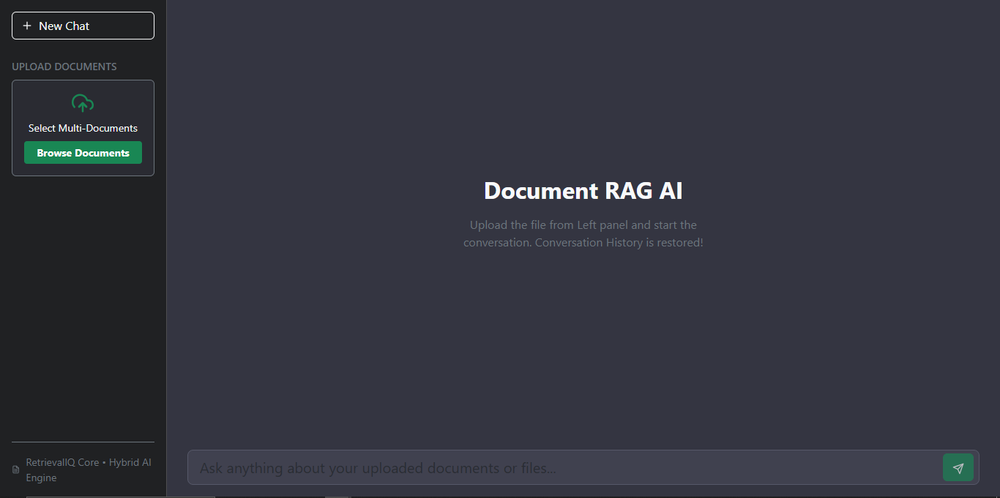
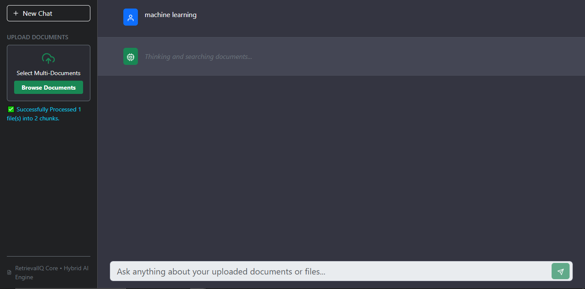
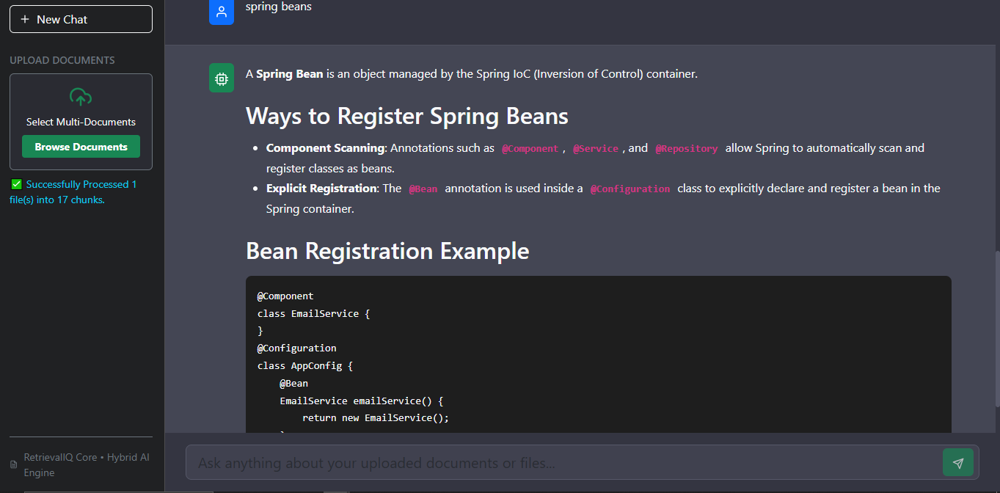
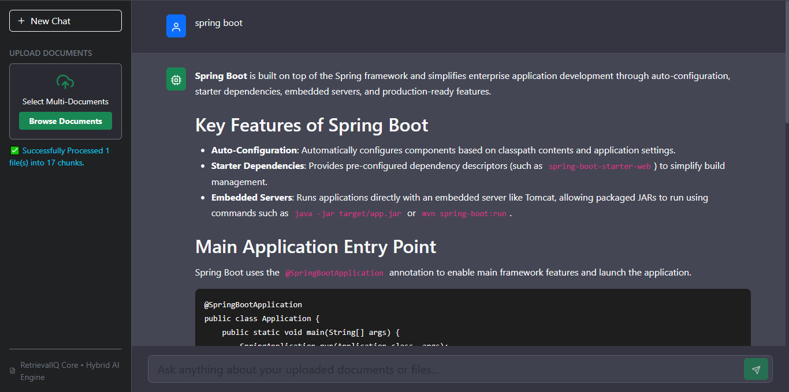

# 🚀 RetrievalIQ - Advanced Multi-PDF Hybrid RAG Application

<div align="center">

[](https://retrievaliq.onrender.com)
[](https://rag-backend-6pkf.onrender.com/docs)
[](https://www.python.org/)
[](https://react.dev/)

**RetrievalIQ** is a production-grade, full-stack **Hybrid RAG (Retrieval-Augmented Generation)** application designed to ingest multi-format documents, perform high-precision hybrid searches (Dense + Sparse), and stream context-aware AI answers using Google Gemini models.

[🔗 View Live Application](https://retrievaliq.onrender.com) | [📖 API Documentation](https://rag-backend-6pkf.onrender.com/docs)

</div>


## 📸 Application UI Previews

<div align="center">
  
  
  <br>
  
  
</div>


## ✨ Key Features

- **Hybrid Search Engine (`FAISS` + `BM25`)**: Combines dense vector semantic search (via Google GenAI embeddings) with sparse keyword search (BM25) using an `EnsembleRetriever` for maximum retrieval accuracy.
- **Multi-Format Document Support**: Beyond standard PDFs, natively parses and indexes **Word documents (`.docx`)**, **PowerPoint presentations (`.pptx/.ppt`)**, and **Text files (`.txt`)**.
- **Real-Time Streaming Responses**: Implements Server-Sent Events (SSE) to stream AI responses token-by-token with auto-scrolling UI.
- **Robust LLM Fallbacks**: Automatically falls back across multiple Gemini models (`gemini-3.6-flash`, `gemini-2.5-flash`, `gemini-1.5-flash`) to ensure high availability and bypass rate limits.
- **Session-Based Chat History**: Maintains isolated conversation sessions per user/browser tab.
- **Modern Dark UI**: Built with React, Bootstrap, and `react-markdown` featuring customized code syntax rendering.

## 🏗️ System Architecture
       ┌───────────────────────────────────┐
       │       React.js Frontend UI        │
       └─────────────────┬─────────────────┘
                         │
         HTTP POST & SSE Token Stream
                         ▼
       ┌───────────────────────────────────┐
       │          FastAPI Backend          │
       └──────┬─────────────────────┬──────┘
              │                     │
              ▼ (/upload)           ▼ (/chat/stream)
    ┌──────────────────────────┐ ┌───────────────────────────────────┐
    │ Multi-Format Ingestion   │ │ Hybrid Retrieval & RAG            │
    │ • PyPDFLoader (.pdf)     │ │ • EnsembleRetriever (0.5 / 0.5)   │
    │ • python-docx (.docx)    │ │ • FAISS Vector Store (Semantic)   │
    │ • python-pptx (.pptx)    │ │ • BM25 Pickle Store (Keyword)     │
    │ • Text Loader (.txt)     │ └─────────────────┬─────────────────┘
    └─────────────┬────────────┘                   │
                  ▼                                ▼
    ┌──────────────────────────┐ ┌───────────────────────────────────┐
    │ Text Splitting           │ │ Google Gemini LLM                 │
    │ RecursiveCharacterSplit  │ │ • Multi-Model Fallback Chain      │
    └─────────────┬────────────┘ │   (gemini-3.6/2.5/1.5-flash)      │
                  ▼              └───────────────────────────────────┘
    ┌──────────────────────────┐
    │ Storage & Indexing       │
    │ • FAISS Index            │
    │ • BM25 Store (.pkl)      │
    │ • Uploaded Files (Dir)   │
    └──────────────────────────┘

       
### 🔄 End-to-End Execution Flow (Upload to Answer Generation)

#### **Phase 1: Document Ingestion & Indexing (Upload to Storage)**
1. **File Selection:** User selects multi-format files (`.pdf`, `.docx`, `.pptx`, `.txt`) from the React Sidebar UI and clicks upload.
2. **API Request (`/upload`):** The frontend sends a multipart `FormData` request to the FastAPI backend.
3. **File Saving:** FastAPI validates file extensions and saves the raw files locally inside the `uploaded_docs/` directory.
4. **Parsing & Chunking (`pdf_loader.py`):** 
   - Custom loaders (`PyPDFLoader`, `python-docx`, `python-pptx`, plain text readers) extract raw text along with source metadata.
   - `RecursiveCharacterTextSplitter` breaks down the large text into manageable chunks (`chunk_size=1200`, `chunk_overlap=200`).
5. **Embedding & Indexing:**
   - **Dense Index:** Chunks are passed to Google's `gemini-embedding-2-preview` model to create vector embeddings, which are saved in a local **FAISS** index directory (`vector_db/faiss_index`).
   - **Sparse Index:** A **BM25 retriever** is initialized from the chunks and serialized into a pickle file (`vector_db/bm25_store.pkl`).

#### **Phase 2: Querying & Hybrid Retrieval (Chat Interaction)**
1. **User Question:** The user types a query in the chat input and sends it along with a unique `session_id` to `/chat/stream`.
2. **Retriever Construction (`rag_chain.py`):** 
   - The app loads the saved FAISS vector store and unpickles the BM25 store.
   - An **`EnsembleRetriever`** combines both retrievers with equal weights (`0.5, 0.5`) to fetch the top-k most relevant chunks combining exact keyword matching and semantic meaning.

#### **Phase 3: Context-Aware Generation & Streaming**
1. **Chat Memory Integration:** The session history is fetched using `ChatMessageHistory` to maintain conversational context.
2. **Prompt Construction:** Retrieved context chunks, chat history, and user questions are mapped into a strict system prompt that enforces strict source rules (no hallucinations, proper markdown structure, correct code block formatting).
3. **LLM Fallback Chain:** The backend invokes Google Gemini (`gemini-3.6-flash`, falling back to `gemini-2.5-flash` or `gemini-1.5-flash` if rate limits occur).
4. **Token Streaming (SSE):** 
   - Using LangChain's asynchronous event stream (`astream_events`), the generated response tokens are wrapped in Server-Sent Events (`data: [JSON_CHUNK]\n\n`).
   - The React frontend reads the stream chunk-by-chunk using a `ReadableStreamDefaultReader`, decodes the text, and updates the state live for a typewriter effect.
5. **Session Saving:** Once complete, the full question and final response are saved to the session history cache.


## 🏗️ Architecture & Tech Stack

### **Backend (`/backend`)**
* **Framework:** FastAPI (Python)
* **Orchestration:** LangChain, LangChain-Community
* **Vector Store & Retrieval:** FAISS, Rank-BM25, EnsembleRetriever
* **Embeddings & LLM:** Google Generative AI (`gemini-embedding-2-preview`, `gemini-flash` series)
* **File Parsers:** PyPDF, python-docx, python-pptx

### **Frontend (`/frontend`)**
* **Library:** React.js 
* **Styling:** Bootstrap, React Icons
* **Markdown Support:** `react-markdown` with code-block highlighting


## 📂 Project Structure

```text
RetrievalIQ/
├── backend/
│   ├── app/
│   │   ├── __init__.py
│   │   ├── config.py           # Configuration & env management
│   │   ├── main.py             # FastAPI entrypoint & routes
│   │   ├── pdf_loader.py       # Multi-format document loaders & indexers
│   │   └── rag_chain.py        # Hybrid retriever, fallbacks & streaming logic
│   ├── uploaded_docs/          # Storage for uploaded files
│   ├── vector_db/              # FAISS index & BM25 pickled store
│   ├── Dockerfile              # Backend containerization
│   └── requirements.txt        # Python dependencies
├── frontend/
│   ├── public/                 # Static assets
│   ├── src/
│   │   ├── components/
│   │   │   ├── ChatWindow.jsx  # Chat message history & markdown renderer
│   │   │   ├── MessageInput.jsx# User input field with send triggers
│   │   │   └── Sidebar.jsx     # Document uploader & navigation
│   │   ├── App.jsx             # Main state & SSE stream handler
│   │   ├── index.js
│   │   └── index.css
│   ├── Dockerfile              # Frontend containerization
│   └── package.json            # Node dependencies
└── .gitignore
```

## ⚙️ Local Installation & Setup
**1. Clone the Repository**
``` text
git clone [https://github.com/rashijaiswal22/RetrievalIQ.git](https://github.com/rashijaiswal22/RetrievalIQ.git)
cd RetrievalIQ
```
**2. Backend Setup**
```text
cd backend
python -m venv .venv
source .venv/bin/activate  # On Windows use: .venv\Scripts\activate
pip install -r requirements.txt
```
**Create a .env file inside the backend folder:**

```
GEMINI_API_KEY=your_google_gemini_api_key_here
HF_TOKEN=your_huggingface_token_optional
```

**Run the FastAPI server:**

```
uvicorn app.main:app --reload --host 0.0.0.0 --port 8000
```
**3. Frontend Setup**
Open a new terminal tab:
```
cd frontend
npm install
npm start
```
**🌐 Deployment Links**
* Frontend App: https://retrievaliq.onrender.com
* Backend API / Swagger Docs: https://rag-backend-6pkf.onrender.com/docs
